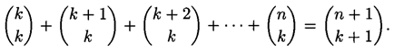

**Binomial co-efficient** comes from **Binomial theorem** in elementary algebra. **Binomial co-efficient** is immensely used to solve counting problems. If you already know about it you can't deny how useful it is for counting problems. Basically I am gonna present here some advanced properties of **Binomial co-efficient**. Before that it's good to know basics of  **Binomial theorem**. **Binomial** is a **Polynomial** with only 2 terms. **Polynomial** with only 1 term called **Monomial**. Here are few examples:

> Monomial: x2, 3x4

> Binomial: x2 - y3, (x + y)6 , (x - y)3

> Polynomial: 3x2 + y3 + xy

If you don't familiar with polynomial have a look at this link: [Polynimial Basics](https://www.mathsisfun.com/algebra/polynomials.html)  

Let's get back to our context which is **Binomial**. What if we want to multiply a **Binomial** with itself several times ? That's implies we want to find out power of a **Binomial**. Suppose a binomial (x+y). We want to find (x+y)3. **Binomial theorem** helps us to do it easily and it exposes the result as a summation of multiple terms. Like this:

In above example notice co-efficients of the terms (1, 4, 6, 4, 1) and these co-efficients are known as **Binomial co-efficient**. It's time to see general formula of **Binomial theorem**:

Using summation notation it will look like:

When y = 1,

More specifically, when x = 2,

When x = 3,

Number of co-efficients is increased along with increasing power of binomial. Here is binomial co-efficient table:

`Show table here`

Now I am gonna present main content of this article which are properties/identities of binomial coefficient and these properties/identities are quite interesting to me.

##### Property 1: Symmetry Property
This property is very familiar to someone who knows binomial co-efficient.

##### Property 2: Pascal’s triangle Property
To calculate binomial co-efficient pascal triangle is very useful

##### Property 3: Monotonicity Property

##### Property 4: Sum of Binomial Co-efficient Property

##### Property 5: 

##### Property 6:

##### Property 7: Alternating Sum Property

##### Property 8: Vendermonde Property

##### Property 9: 

##### Property 10: 

##### Property 11: 

##### Property 12: 

Please comment below if you find anything wrong in above article.