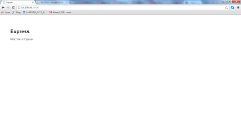

In this tutorial we are going to learn how to use handlebars view engine and mongoDB with express 4. There are few view/template engines for Node.js. All of them have some advantages and disadvantages. So far I have seen 5 view engines for Node.js:

    1. Jade
    2. EJS (Embedded JS)
    3. JSHTML
    4. Mustache
    5. Handlebars

===

My web development background grows in PHP and few frameworks of PHP (e.g CI, Yii). Since I always used HTML as template from my very early phase of web development I can’t think without HTML. Among these view engines I preferred Handlebars because it supports HTML as template.

I will not describe much about how it works except it is very essential to understand. At the end of this tutorial you will have a web app skeleton with database from which you will able to start your real life web app project for Node.js.

##### STEP 1: Install Express
Express is a web development framework for Node.js. Express will create a web application skeleton for you very quickly. Open Node Command Prompt. Run the following command to install express:

```sh
npm install -g express
```

In the above command “-g” helps you to install express in your Node.js installation directory so that you can use express globally in any directory, otherwise it will download express in your current directory.

##### STEP 2: Install Express Generator

As of express 4 you will need to install express generator also. Run following command:
```sh
npm install -g express-generator
```

##### STEP 3: Create a Express Project
Go to your desired directory in which you will create your app directory. Let give a name for our test project and it could be like “hbs-mongo-with-express”. Run this command:

```sh
express hbs-mongo-with-express4
```

You will get following output if everything okay.

```sh
create : hbs-mongo-with-express4
create : hbs-mongo-with-express4/package.json
create : hbs-mongo-with-express4/app.js
create : hbs-mongo-with-express4/public
create : hbs-mongo-with-express4/routes
create : hbs-mongo-with-express4/routes/index.js
create : hbs-mongo-with-express4/routes/users.js
create : hbs-mongo-with-express4/views
create : hbs-mongo-with-express4/views/index.jade
create : hbs-mongo-with-express4/views/layout.jade
create : hbs-mongo-with-express4/views/error.jade
create : hbs-mongo-with-express4/public/stylesheets
create : hbs-mongo-with-express4/public/stylesheets/style.css
create : hbs-mongo-with-express4/public/javascripts
create : hbs-mongo-with-express4/public/images
create : hbs-mongo-with-express4/bin
create : hbs-mongo-with-express4/bin/www

install dependencies:
  $ cd hbs-mongo-with-express4 && npm install

run the app:
  $ DEBUG=hbs-mongo-with-express4 ./bin/www
```

##### STEP 3: Resolve Dependencies

Right now we have basic skeleton of web app but it’s not runnable. Let’s check what happens if  we start our app. Go to your app directory “hbs-mongo-with-express4”. Run following command to start your web app.

```sh
npm start
```

Web app will not start and a list of error messages will be shown.

We can’t run our web app until we resolve the dependencies described in “package.json”. Your “package.json” file should looks like:

```json
{
  "name": "hbs-mongo-with-express4",
  "version": "0.0.0",
  "private": true,
  "scripts": {
    "start": "node ./bin/www"
  },
  "dependencies": {
    "express": "~4.9.0",
    "body-parser": "~1.8.1",
    "cookie-parser": "~1.3.3",
    "morgan": "~1.3.0",
    "serve-favicon": "~2.1.3",
    "debug": "~2.0.0",
    "jade": "~1.6.0"
  }
}
```

Here you see there are lots of dependencies that mean you can’t run your app until you download these libraries. NPM has a command to download/resolve all dependencies. Here is the command:

```sh
npm install
```

You will see the list of added/resolved libraries into your app. Note that a new directory created in your app directory named “node_modules” in which all the depended modules are placed. Now run your app by running command: “npm start”.

Open your browser and go to http://localhost:3000. You must see the following page:



Do you know how to stop your Node.js web app? Press Ctrl+C

##### STEP 4: Install HBS, MONGO

Before we going to understand the code inside our app let’s finish installation of Handlebars and MongoDB. NPM has a command “install” by which a particular module can be installed. To install Handlebars run following command:

```sh
npm install -save hbs
```

“-save” will add “hbs” with version number in your dependency list in “package.json”. For example, I just executed following command and following line added in dependency list:

> "hbs": "^2.7.0",

Okay, we have to go far away from here. Quickly run these commands to install MongoDB:

```sh
npm install --save mongo
npm install --save mongodb
npm install --save monk
```

My “package.json” looks like following:

```json
{
  "name": "hbs-mongo-with-express4",
  "version": "0.0.0",
  "private": true,
  "scripts": {
    "start": "node ./bin/www"
  },
  "dependencies": {
    "body-parser": "~1.8.1",
    "cookie-parser": "~1.3.3",
    "debug": "~2.0.0",
    "express": "~4.9.0",
    "hbs": "^2.7.0",
    "jade": "~1.6.0",
    "mongo": "^0.1.0",
    "monk": "^0.9.1",
    "morgan": "~1.3.0",
    "serve-favicon": "~2.1.3"
  }
}
```

##### STEP 5: Understand Express Code
Now we will try to understand express app architecture and some default code written by express. First of all you may assume that Express app is in MVC architecture by looking the folders inside app directory. Actually Express is not a MVC framework. Although Express isn’t a MVC framework we can make it MVC or any other MVC framework can be used along with Express. We are not going to that topic. Let’s come to the point. Express created a lot of stuff for us.

a. Your express app starts from “app.js”. 

b. “views” folder will contain your views (Views of MVC).

c. “routes” folder will contain only JavaScript files. If you are experienced with MVC framework in PHP or ASP, you may compare this with Controller. Reality is Routes are kind of like a combination of Controllers and Models in express js setup.

d. “public” folder will contain CSS, images, JavaScript for views.

Let’s try to dissect app.js:

At first of app.js you will see that there are lots of initialization using requires method. Yes it’s obvious that you need to load your desired library/packages/dependencies which you want to use in your app. After loading all necessary packages and ties them into variables you are initializing your express app by putting this line:

```js
var app = express();
```

This single method “express()” will instantiate an express app and assign it into app variable. Next 2 lines are setting up view engine for the whole app and by default express use JADE view engine which I mentioned earlier of this article. Look we are also telling JADE where to find view files of this app.

```js
// view engine setup
app.set('views', path.join(__dirname, 'views'));
app.set('view engine', 'jade');
```

Next few lines are setting some necessary setup which will be discussed later. Following two lines are telling our app to use these 2 routes.

```js
app.use('/', routes);
app.use('/users', users);
```

Here are next few lines:

```js
// catch 404 and forward to error handler
app.use(function(req, res, next) {
    var err = new Error('Not Found');
    err.status = 404;
    next(err);
});
 
// error handlers
 
// development error handler
// will print stacktrace
if (app.get('env') === 'development') {
    app.use(function(err, req, res, next) {
        res.status(err.status || 500);
        res.render('error', {
            message: err.message,
            error: err
        });
    });
}
 
// production error handler
// no stacktraces leaked to user
app.use(function(err, req, res, next) {
    res.status(err.status || 500);
    res.render('error', {
        message: err.message,
        error: {}
    });
});
```

First few lines of above segment telling our app what will be done when 404 occur.  Then there are development error handler and production error handler which will be useful which developing real production app using Node. You can see logs using these handlers. For example you want to see more error logs when in development phase or while developing your app and for production you will show few logs to user which will not break your app security.

We have done our express app setup. Now export the app object.

```js
module.exports = app;
```

##### STEP 6: Discard JADE View Engine and Setup HBS
Comment/Delete the JADE setup lines:

```js
// view engine setup
//app.set('views', path.join(__dirname, 'views'));
//app.set('view engine', 'jade');
```

Delete view files of JADE from views folder. Make sure your views folder is empty now.

Load “fs” and “hbs” package and assign them into variables.

```js
var hbs = require('hbs');
var fs = require('fs');
```

Tell hbs which directory will contain partial views. Create a directory “partials” if not already in there.

```js
hbs.registerPartials(__dirname + '/views/partials');
```

Setup view engine to use HBS:

```js
// set the view engine to use handlebars
app.set('view engine', 'hbs');
app.set('views', __dirname + '/views');
```

Now we will create some view files. First of all “layout” view. If you are familiar with web development you probably know the significance of “layout” view. HBS supports two types of view files “.hbs” and “.html” as I told you at the beginning of this article HBS supports HTML file. Now create “layout.hbs” file and copy the following code.

```html
<!doctype html>
<html>
      <head>
        <title>{{title}}</title>
        <link rel='stylesheet' href='/css/style.css'>
      </head>
      <body>
            {{> header}}
            {{{body}}}
            {{> footer}}
      </body>
</html>
```

Create “index.hbs” and copy following code:

```html
<div>
      Steps:<br/>
      {{> steps }}
</div>
```

In “partials” folder make three files: “header.html”, “footer.html”, “steps.html”


In header.html file:
```html
<div>Header: Handlebars and MongoDB with Express 4<hr /></div>
```

In footer.html file:
```html
<div><hr />Footer: Enjoy Node.js</div>
```

In steps.html file:
```html
STEP 1: Install Express<br />
STEP 2: Install Express Generator<br />
STEP 3: Create a Express Project<br />
STEP 3: Resolve Dependencies<br />
STEP 4: Install HBS, MONGO<br />
STEP 5: Understand Express Code<br />
STEP 6: Discard JADE View Engine and Setup HBS<br />
.............<br />
```

Now open “index.js” file in “routes” folder.  Make sure you are sending a “title” while rendering page “index” like this:

```js
/* GET home page. */
router.get('/', function(req, res) {
  res.render('index', { title: 'Handlebars and MongoDB with Express 4' });
});
```

Okay. We are done. Run your app.

##### STEP 7: Create Mongo Database

Probably you that Mongo is a NoSQL Database but no Server less like SQLite. First of all decide in which directory your database will be created. In our app let’s make a directory in our project folder named “data”. Start MongoDB server by running the following command a command prompt:

```sh
mongod --dbpath [Path of your data folder]
```

Your mongoDB server/service is up now. Don’t stop until you end or quit this tutorial. Let’s try to connect to server from another command prompt. Run following command:
```sh
mongo
```

You will see the text `[initandlisten]` at last if everything okay.

For beginners of mongoDB here are some commands to do basic stuffs with mongoDB. You can remember the following commands:

| Commands | Result |
| ------ | ----------- |
| `mongod --dbpath [PATH]`   | will start the MongoDB service |
| `mongo` | will step you inside the MongoDB shell (when run in a new terminal while Mongod is running) |
| `show dbs` | will show the list of databases |
| `use <<database name>>` | will step you inside the database |
| `show collections` | will show the list of collections once you are inside the database |

So far we have set database path and started mongoDB service. But didn’t create a database. Run following command to create/use a database. If any database is not created with the given name new database will be created.

```sh
use tutorialdb
```

Now we are using database `tutorialdb`.

You may notice that two new files are created in your data folder. They are `tutorialdb.0` and `tutorialdb.ns`.

##### STEP 8: Use MongoDB in your app

First we need to load two packages (Mongo and Monk) and tie them into variables.

```js
var mongo = require('mongodb');
var monk = require('monk');
var db = monk('localhost:27017/tutorialdb');
```

In the above code we are denoting which database we are going to use using the monk() method.

Add following lines just before the lines in which we are setting routes. It’s important and will be discussed later.

```js
// Make our db accessible to our router
app.use(function(req,res,next){
    req.db = db;
    next();
});
```

For learning purpose we are going to do CRUD operations in app. A typical web app must have some users. We are going to do CRUD operations on “users”. Let’s make some routes for these operations:

> `http://localhost:3000/users`

Show user list with delete and update feature (RUD)

> `http://localhost:3000/users/new`

Insert a new user (C)

So your `routes/users.js` should looks like:

```js
var express = require('express');
var router = express.Router();
 
/* READ, UPDATE, DELETE users */
router.get('/', function(req, res) {
  res.send('Show user list with delete and update feature (RUD)');
});
 
/* INSERT user */
router.get('/insert_user', function(req, res) {
      res.send("Insert a new user (C)");
});
 
/* NEW user */
router.get('/new', function(req, res) {
      res.render('user-new');
});
 
module.exports = router;
```

For the above two routes we are going to make two views. `user-list.hbs` and `user-new.hbs`

File: `user-new.hbs`
```html
<div>New User</div>
<div>
      <form name="adduser" method="post" action="http://localhost:3000/users/insert_user">
        <label for="name">Name</label>
        <input type="text" name="name" />
        <label for="email">Email</label>
        <input type="text" name="email" />  
       
        <input type="submit" name="submit" value="Add User" />
      </form>
</div>
```

File: `user-list.hbs`

```html
<div>User List</div>
<div>
      <ul>
            {{#each userlist}}
            <li>{{username}}&nbsp;({{email}})</li>
            {{/each}}
      </ul>
</div>
```

In the view file “user-list.hbs” we will provide an array “userlist” from routes after fetching from database. This is the way to ride over an array in Handlebars.

Let’s go back to “users.js” file. You saw the method and action of New User form. So let’s build the route `http://localhost:3000/users/insert_user`.

```js
/* INSERT user */
router.post('insert_user', function(req, res) {
      // Get the only one db instance in our app
      var db = req.db;
 
      // Get POST values, It's easy
      var userName = req.body.name;
      var userEmail = req.body.email;
      console.log('POST VALUES: ' + userName + ' ' + userEmail);
     
      // Fetch from 'users' collection
      var userCollection = db.get("users");
      userCollection.insert({
            'username' : userName,
            'email' : userEmail
      }, function(err, doc) {
            if(err) res.send('Problem occured when inserting in users collection');
            else {
                  console.log("Inserted");
                  res.location('users');
                  res.redirect('/users');
            }
      });
});
```

Complete code for `http://localhost:3000/users/new`

```js
/* NEW user */
router.get('/new', function(req, res) {
      res.render('user-new');
});
```

Complete code for `http://localhost:3000/users/`

```js
/* READ, UPDATE, DELETE users */
router.get('/', function(req, res) {
      // Get the only one db instance in our app
      var db = req.db;
      // Fetch from 'users' collection
      var userCollection = db.get("users");
      userCollection.find({}, {}, function(e, docs) {
            res.render('user-list', {'userlist' : docs});
      });
});
```

Okay. It’s over. Run your node app and see is it working or not. I am not explaining the last few codes due to time constraint. Basically I am also new in Node.js web app development. I wrote this tutorial as note for me. Here we have just taken a bit taste of web app development using Node.js. We have to go long way for professional development in Node.js and its packages. There are lots of stuffs (node.js packages) we (including me) need to taste. In the following link you will find them all categorized.

> https://github.com/sindresorhus/awesome-nodejs

BTW, All the above codes will be found here as a node app. Don’t forget to resolve dependencies before running app:

> https://github.com/mahbub08kuet/hbs-mongo-with-express4

Goodbye and take care.